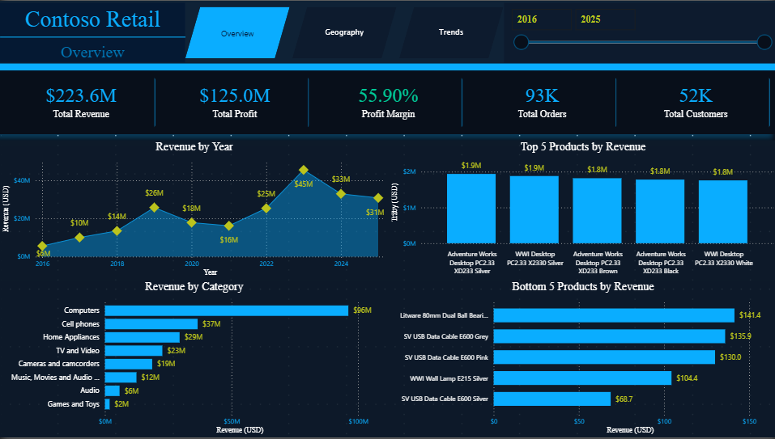
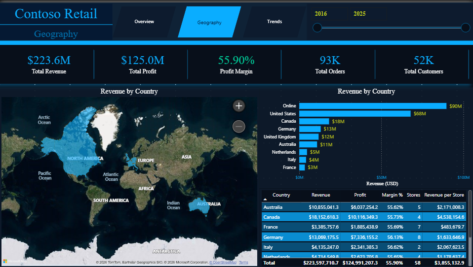
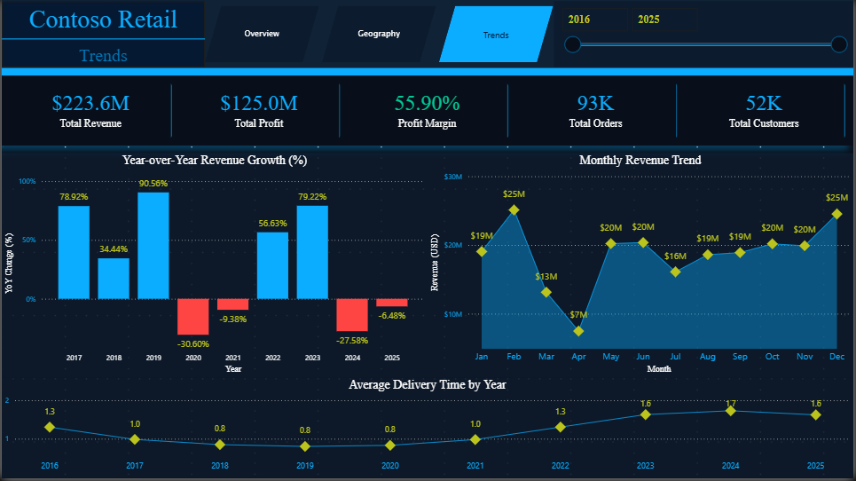

# Contoso Retail — Power BI Dashboard

Analytický dashboard na úrovni vedení společnosti, postavený na datasetu SQLBI Contoso.
Projekt pokrývá **tržby ve výši 223 mil. USD** napříč **8 zeměmi, 67 prodejnami a 10 lety dat (2016–2025)**.
Simuluje reálný BI workflow — od práce se surovými CSV soubory přes datové modelování a DAX výpočty až po finální dashboard zaměřený na podporu rozhodování.
---

## Stránky dashboardu

### Přehled
Souhrn klíčových metrik pro management:
- Tržby
- Zisk
- Marže
- Počet objednávek
- Počet zákazníků

Doplněno o:
- Vývoj tržeb podle roku
- Top 5 produktů podle tržeb
- Rozpad tržeb podle kategorie



---

### Geografie
Geografická distribuce výkonu:
- Mapa tržeb podle země a online kanálu
- Sloupcový graf tržeb podle země
- Detailní tabulka obsahující:
  - Tržby
  - Zisk
  - Marži
  - Počet prodejen
  - Tržby na prodejnu



---

### Trendy
Časová analýza zaměřená na vývoj a provozní signály:
- Meziroční změna tržeb (YoY)
- Sezónnost tržeb podle měsíců
- Průměrná doba doručení



---

## Klíčová zjištění

- **Vysoká koncentrace tržeb** — kategorie Počítače generuje **96 mil. USD (43 % celkových tržeb)**
- **Dominance online kanálu** — 90 mil. USD, více než jakákoliv jednotlivá země
- **Nestabilní růst** — vrchol v roce 2023 (45 mil. USD), následovaný poklesem o **-27,6 % v roce 2024**
- **Silná sezónnost** — únor a prosinec jsou nejvýkonnější měsíce, duben je opakovaně nejslabší
- **Zhoršení provozní výkonnosti** — doba doručení vzrostla z 0,8 dne na 1,7 dne
- **Rozdílná efektivita prodejen** — Itálie dosahuje vysokých tržeb na prodejnu, zatímco USA spoléhají na objem

---

## Doporučení

Na základě analýzy lze navrhnout následující kroky:

### 1. Diverzifikace produktového portfolia
Závislost na kategorii Počítače představuje riziko.
→ Rozšířit podporu pro méně výkonné kategorie (marketing, pricing, bundling)

### 2. Posílení online strategie
Online kanál je hlavním zdrojem tržeb.
→ Optimalizovat UX, logistiku a marketing zaměřený na digitální prodej

### 3. Stabilizace meziročního růstu
Výrazný pokles v roce 2024 signalizuje problém.
→ Analyzovat příčiny (externí vlivy, konkurence, pricing) a zavést stabilizační opatření

### 4. Využití sezónnosti
Silné sezónní vzorce představují příležitost.
→ Maximalizovat výkon v únoru a prosinci (kampaně, zásoby)  
→ Podpořit slabé období (duben) cílenými akcemi

### 5. Zlepšení logistické výkonnosti
Rostoucí doba doručení může negativně ovlivnit zákaznickou zkušenost.
→ Optimalizace procesů, kapacit a dodavatelského řetězce

### 6. Optimalizace prodejní sítě
Různá výkonnost mezi zeměmi ukazuje rozdílné strategie.
→ Zaměřit se na efektivitu (tržby na prodejnu), ne pouze na počet prodejen

---

## Dataset

**Zdroj:** https://github.com/sql-bi/Contoso-Data-Generator

| Soubor | Řádky | Popis |
|---|---:|---|
| sales.csv | 100 000 | Transakční prodejní data |
| orders.csv | 93 471 | Hlavičky objednávek |
| orderrows.csv | 100 000 | Řádky objednávek |
| customer.csv | ~10 000 | Dimenze zákazníků |
| product.csv | ~2 500 | Dimenze produktů |
| store.csv | 67 | Dimenze prodejen |
| date.csv | 3 650 | Dimenze datumu |
| currencyexchange.csv | — | Směnné kurzy |

**Časové rozpětí:** 2016–2025  
**Země:** USA, Kanada, UK, Německo, Francie, Nizozemsko, Itálie, Austrálie + Online

---

## Technologie

| Nástroj | Účel |
|---|---|
| Power BI Desktop | Vývoj dashboardu |
| DAX | Výpočty |
| Power Query | Transformace dat |
| CSV | Zdroj dat |

---

## Datový model

Hvězdicové schéma s tabulkou `sales` jako faktovou tabulkou.
- 9 aktivních relací
- 6 dimenzionálních tabulek
- Směnné kurzy aplikovány přímo v DAX pomocí `SUMX`

---

## DAX míry

```dax
Revenue USD = SUMX(sales, sales[NetPrice] * sales[Quantity] * sales[ExchangeRate])

Total Profit = [Revenue USD] - [Total Cost]

Profit Margin % = DIVIDE([Total Profit], [Revenue USD])

Total Orders = DISTINCTCOUNT(orders[OrderKey])

Total Customers = DISTINCTCOUNT(orders[CustomerKey])

Avg Delivery Days = 
AVERAGEX(
    sales,
    DATEDIFF(sales[OrderDate], sales[DeliveryDate], DAY)
)

Revenue YoY % = 
DIVIDE(
    [Revenue USD] - CALCULATE([Revenue USD], SAMEPERIODLASTYEAR('date'[Date])),
    CALCULATE([Revenue USD], SAMEPERIODLASTYEAR('date'[Date]))
)

Active Stores = 
COUNTROWS(store) 
- CALCULATE(COUNTROWS(store), store[Status] = "Closed")
- CALCULATE(COUNTROWS(store), store[Status] = "Restructured")
```

> Poznámka: Vyšší marže (~56 %) je dána syntetickým charakterem datasetu.

---

## Design

- Pozadí: `#080F1A`
- Primární barva: `#0AADFF`
- Sekundární: `#034D77`
- Zvýraznění: `#BBC31D`

**Jazyk dashboardu:** angličtina  
**Popis projektu:** čeština  
**Cílová skupina:** management a business uživatelé

---

## Jak otevřít

1. Stáhnout soubor `contoso.pbix`
2. Otevřít v Power BI Desktop
3. Data jsou součástí souboru, není potřeba externí připojení

---

## Autor

**Stanislav Patlakha**  
Junior Data Analyst (aspiring) | Teplice, Česká republika

- **LinkedIn:** https://www.linkedin.com/in/stanislav-patlakha-0b51893b2/
- **GitHub:** https://github.com/Last-to-say
